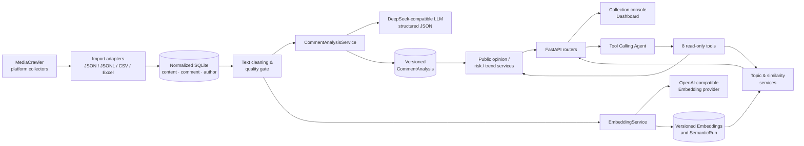
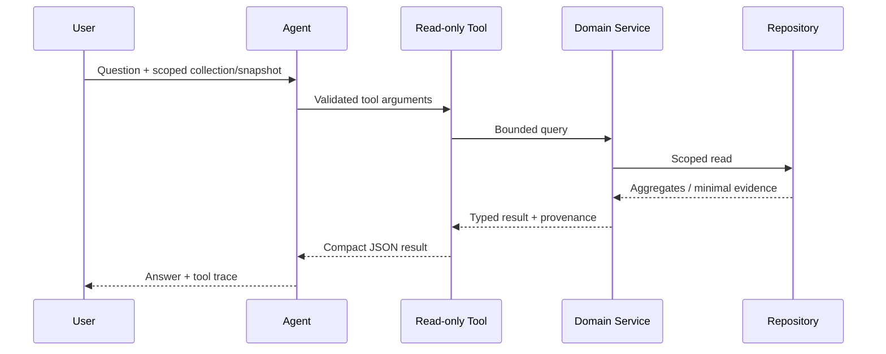

# Architecture

## Positioning

AbstractTikTok is a Python AI application layered on top of the existing MediaCrawler collection capability. The crawler remains responsible for acquiring data; the AI application reads normalized records through explicit repository boundaries.

## Module boundaries

| Boundary | Responsibility | Must not do |
| --- | --- | --- |
| `media_platform/`, `store/` | Collect and export source-platform data | Depend on LLM or Agent logic |
| `analysis/ingest` and adapters | Convert exports into normalized records | Expose raw platform schema to analytics |
| `analysis/domain/` | Stable entities, snapshots and query results | Call HTTP or SQL directly |
| `analysis/services/` | Orchestrate cleaning, providers, aggregation and workflows | Render HTML or own request state |
| `analysis/repositories/` | SQLAlchemy persistence/query boundary | Infer product policy or call a provider |
| `analysis/agent/` | Tool schemas, safety limits and answer orchestration | Query tables directly |
| `api/` | HTTP schemas, routers, workflow status and WebUI | Re-implement domain calculations |

## Snapshot consistency

A dashboard request is bound to an `AnalysisSnapshot`, not to “whatever analysis happened last”. The snapshot records versions for analysis, prompt and embedding as well as a `semantic_run_id`. Public-opinion, topic, trend, search and Agent tool calls carry this scope forward.

This prevents a familiar analytics failure: a new model run for one comment silently changing totals or mixing representative comments from another run.

## Agent safety boundary

The Agent has a maximum tool-step budget, duplicate-call protection, tool argument validation and bounded result sizes. It cannot mutate collection data, analysis records or database state.

## Provider roles

The project intentionally keeps the LLM and embedding providers separate:

- A DeepSeek-compatible chat completion endpoint produces structured comment labels and answers Tool Calling requests.
- An OpenAI-compatible embedding endpoint supplies vectors for semantic retrieval and topic clustering.

Both are configured only in local environment variables. The provider interface is isolated in services, so a provider migration does not require changing crawler code or API contracts.
