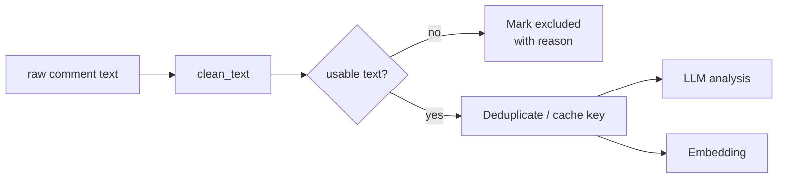
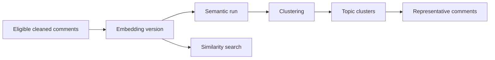

# Data Flow and Analysis Semantics

## 1. From collection to normalized data

1. MediaCrawler collects content, author, first-level and optional second-level comments.
2. An import adapter maps the platform-specific exported fields to normalized content/comment/author records.
3. The importer preserves source identifiers and the raw text needed for traceability while providing a normalized, deduplicated query surface.
4. Import is idempotent: the same source record can be re-imported without creating a second analytical identity.

The normalized model is the contract between the crawler and the AI application. New platforms should add an adapter rather than leak their original JSON shape into every analysis service.

## 2. Text quality gate

Cleaning removes presentation noise and supports deterministic caching. It does not overwrite raw source text. Low-information entries such as empty text, emoji-only fragments or meaningless repetitions are recorded as excluded instead of being sent to a model.

## 3. Versioned comment analysis

Each analysis result is associated with a versioned configuration. The result carries structured fields such as sentiment, emotion, topics, stance, keywords and risk level. Aggregation queries select the configured snapshot rather than a generic newest record.

The service uses bounded batches, a concurrency cap, provider retry policy, request-rate limit and cached duplicate text results. The design avoids the anti-pattern of calling an LLM once per comment in an unbounded loop.

## 4. Semantic path

Semantic accounting distinguishes four quantities:

- eligible comments: comments admitted by the quality gate;
- embedded comments: comments with a vector for the selected embedding version;
- clustering input: vectors admitted to a semantic run;
- clustered comments: comments assigned to a non-noise topic.

Noise is a valid clustering outcome, not a failed embedding or failed analysis. This distinction makes dashboard coverage and topic quality interpretable.

## 5. Dashboard and historical records

The collection console generates an analysis context after a crawl. Its completion action opens the dashboard with that context. The data-management dialog offers the same path for selected historical records; the dashboard changes scope without automatically rerunning model analysis.

Refreshing analysis is an explicit user action. It creates or continues an analysis workflow and then refreshes the same dashboard scope. This separates navigation from cost-bearing provider work.

## 6. Agent data flow

The Agent receives a question and an immutable data scope. Tools such as `get_comment_statistics`, `get_sentiment_distribution`, `get_topics`, `get_trend`, `search_similar_comments` and `get_high_risk_comments` return typed aggregates plus a deliberately small evidence set. The LLM sees only the tool output required to answer; it does not receive unrestricted comments or a database connection.
